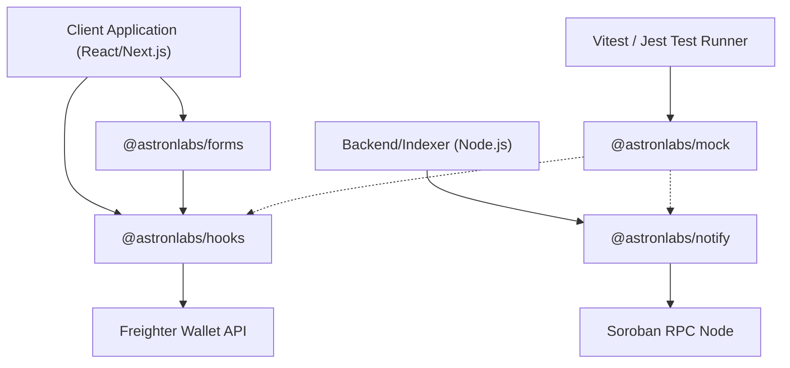
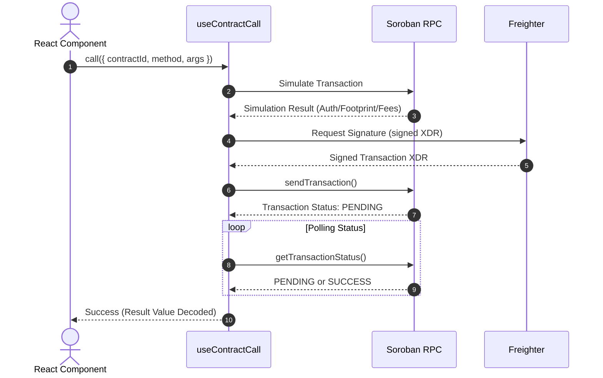
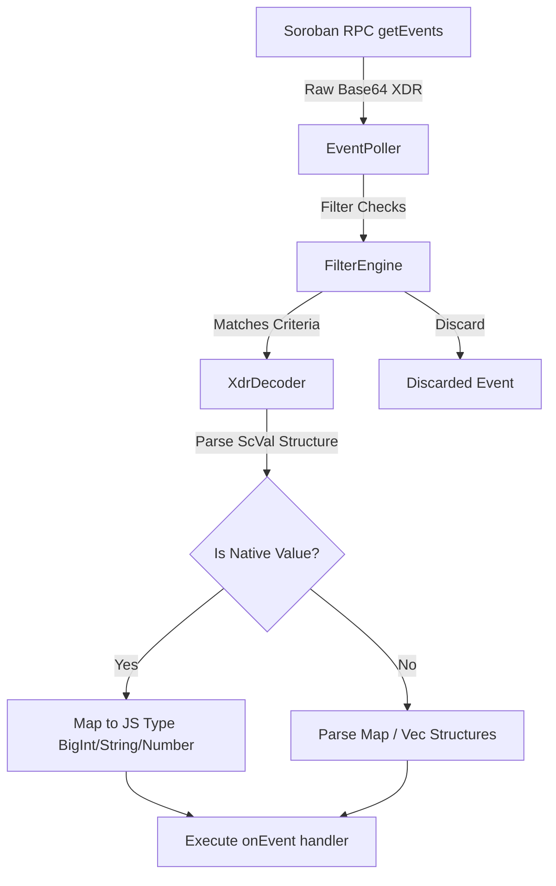
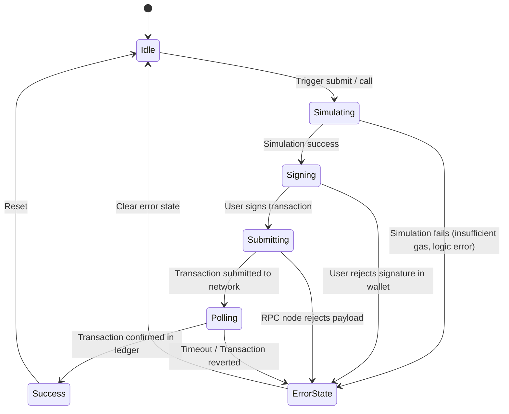

# MergeLabs: Technical Documentation & Architecture Reference

MergeLabs is a TypeScript-first monorepo providing developer tooling, React hooks, headless UI forms, and RPC mocking utilities for the Stellar and Soroban blockchain networks. It is designed to abstract blockchain-specific boilerplate—such as XDR parsing, transaction polling with backoff, wallet management, and event-driven architectures—into modular, type-safe, and production-ready npm packages.

---

## 1. Core Architecture Overview

MergeLabs is structured as a monorepo managed with `pnpm` workspaces. This architecture ensures dependency sharing, rapid local development cycles, and isolated package testing.

### System Topology

The diagram below illustrates the relationship between the MergeLabs package ecosystem, the client application, the web wallet, and the Stellar/Soroban network layers:



### Monorepo Packages

| Package | Purpose | Primary Technologies |
| :--- | :--- | :--- |
| **`@astronlabs/hooks`** | React hooks for wallet connection, balance tracking, and Soroban contract execution. | React, `@stellar/stellar-sdk` |
| **`@astronlabs/forms`** | Headless, validation-enabled form components for sending payments, adding trustlines, and swapping tokens. | React, Formik/React-Hook-Form style state |
| **`@astronlabs/notify`** | High-throughput, XDR-decoding Soroban contract event polling and streaming. | `@stellar/stellar-sdk` (XDR parsing) |
| **`@astronlabs/mock`** | Local testing fixtures, mock Freighter wallet, mock contract state, and virtual RPC server. | Vitest, TypeScript |

---

## 2. Package Specifications

### 2.1. @astronlabs/hooks

This package provides custom React hooks for interacting with the Stellar blockchain and Soroban smart contracts. It manages asynchronous transaction states, balance queries with automatic invalidation, and stateful event subscriptions.

#### `StellarProvider`
To use the hooks, wrap your application in the `StellarProvider` to establish connection parameters for the network.

```tsx
import { StellarProvider } from '@astronlabs/hooks';

export function Root() {
  return (
    <StellarProvider
      config={{
        network: 'testnet',
        rpcUrl: 'https://soroban-testnet.stellar.org',
        horizonUrl: 'https://horizon-testnet.stellar.org', // Optional
      }}
    >
      <App />
    </StellarProvider>
  );
}
```

#### Key Hooks Reference

##### `useFreighter`
Manages wallet connection states, retrieving public keys, and signing operations using the Freighter browser extension.
*   **Returns**:
    *   `publicKey: string | null`
    *   `connected: boolean`
    *   `loading: boolean`
    *   `connect: () => Promise<string>`
    *   `signTransaction: (txXdr: string) => Promise<string>`

##### `useBalance`
Queries the account balance for native XLM or any Stellar Asset Contract (SAC) token. It handles caching, loading states, and balance updates.
*   **Parameters**:
    *   `publicKey: string`
    *   `tokenAddress?: string` (omitting defaults to native XLM)
*   **Returns**:
    *   `balance: string`
    *   `loading: boolean`
    *   `error: Error | null`
    *   `refetch: () => Promise<void>`

##### `useSendPayment`
Handles sending Horizon-based payments (both native XLM and custom assets).
*   **Returns**:
    *   `send: (params: { destination: string, amount: string, memo?: string }) => Promise<{ txHash: string }>`
    *   `loading: boolean`
    *   `error: Error | null`
    *   `result: { txHash: string } | null`

##### `useContractCall`
Facilitates invoking Soroban smart contracts. It handles the complete lifecycle of transaction simulation, wallet signature requests, submission, and transaction tracking.



##### `useTransaction`
Polls the Soroban RPC endpoint to verify transaction status. It uses an exponential backoff algorithm to minimize RPC node overhead while maintaining user responsiveness.
*   **Parameters**:
    *   `txHash: string`
*   **Returns**:
    *   `status: 'PENDING' | 'SUCCESS' | 'FAILED' | 'NOT_FOUND'`
    *   `result: any`
    *   `error: Error | null`

##### `useStellarEvent`
Subscribes to specific Soroban event topics for a given contract. It uses `@astronlabs/notify` under the hood to push real-time event logs to UI components.

---

### 2.2. @astronlabs/notify

`@astronlabs/notify` is a backend-compatible event-streaming library. It polls Soroban RPC endpoints, tracks ledger pagination sequences via a custom Cursor State, and decodes transaction logs.

#### Architectural Mechanics

1.  **Cursor Tracking (`CursorState`)**: Tracks the last processed ledger transaction sequence. This ensures that even in the event of temporary network failure or process restarts, no events are skipped or double-processed.
2.  **Filter Engine (`FilterEngine`)**: Matches event topics, contracts, and topics array criteria using strict binary equivalence checks.
3.  **XDR Decoder (`XdrDecoder`)**: Automatically decodes raw base64 XDR representations of Soroban values into native JavaScript types:
    *   `ScValType.ScvU32` / `ScvI32` $\rightarrow$ `number`
    *   `ScValType.ScvU64` / `ScvI64` / `ScvU128` / `ScvI128` $\rightarrow$ `bigint`
    *   `ScValType.ScvSymbol` / `ScvString` $\rightarrow$ `string`
    *   `ScValType.ScvAddress` $\rightarrow$ `string` (Stellar G-address or C-contract ID)

#### Code Example: Server-side Event Streaming

```typescript
import { StellarNotify } from '@astronlabs/notify';

const notify = new StellarNotify({
  rpcUrl: 'https://soroban-testnet.stellar.org',
  network: 'testnet',
  pollInterval: 3000,
});

// Stream token transfers dynamically
const subscription = notify.subscribe({
  contractId: 'CDA...TOKEN_CONTRACT_ID',
  topics: ['transfer'], // Matches the first event topic (symbol)
  onEvent: (event) => {
    // Decoded variables are accessible on event.data
    const { from, to, amount } = event.data;
    console.log(`[Transfer] From: ${from} | To: ${to} | Value: ${amount.toString()}`);
  },
  onError: (error) => {
    console.error('Event stream error:', error);
  }
});

// Cleanup when finished
process.on('SIGTERM', () => {
  subscription.unsubscribe();
  notify.destroy();
});
```

---

### 2.3. @astronlabs/forms

A headless UI form package integrating React state management with on-chain transaction routines. It delegates presentation to developer-defined render functions, providing functional safety without visual constraints.

#### Render Props Pattern
All components in `@astronlabs/forms` implement the Render Props pattern. You supply the UI, and the form provides:
- Form state validation.
- Connection checks (disabling form submission if wallet is disconnected).
- Stellar transaction execution status.
- Formatting and custom error boundaries.

#### Form Components

##### `SendPaymentForm`
Provides input fields and handlers for sending XLM or custom SAC tokens.
*   **Props**:
    *   `onSuccess?: (txResult: any) => void`
    *   `onError?: (error: Error) => void`
*   **Exported Form Variables**:
    *   `values`: `{ destination: string, amount: string, memo: string }`
    *   `errors`: Form validation errors.
    *   `loading`: Boolean representing on-chain execution.
    *   `handleSubmit`: Form submission handler.

##### `TrustlineForm`
Renders an interface to establish token trustlines (Stellar Classic assets or custom SAC tokens). Essential for dApps that issue custom stablecoins or loyalty points.
*   **Props**:
    *   `assetCode: string`
    *   `assetIssuer: string`
    *   `onSuccess?: (txResult: any) => void`

##### `SwapForm`
Simplifies integrating AMM pool swaps (e.g., Soroswap or native Stellar SDEX) by handling slippage calculations, validation, paths, and transaction signing.

---

### 2.4. @astronlabs/mock

A testing companion package designed to mock wallets, contracts, and RPC servers. This enables rapid, offline integration testing with instant execution speed.

#### Core Mock Utilities

##### `MockRpc`
Simulates a real Soroban RPC endpoint in memory. Allows mocking responses for `getTransaction`, `getEvents`, and `sendTransaction` with configurable network latency simulation.
```typescript
import { MockRpc } from '@astronlabs/mock';

const mockRpc = new MockRpc({
  latency: 150, // Simulates real-world latency in ms
  failRate: 0.01 // Optional: Simulates intermittent network failure rate
});
```

##### `MockFreighter`
Injects a mock window adapter that overrides standard `@stellar/freighter-api` hooks, allowing you to programmatically mock user logins, wallet addresses, and auto-confirm transaction signatures without opening real browser popups.
```typescript
import { MockFreighter } from '@astronlabs/mock';

const mockWallet = new MockFreighter();
mockWallet.setAddress('GD7...MOCK_USER_PUBLIC_KEY');
mockWallet.autoApprove(true); // Automatically sign all transactions
```

##### `MockContract`
Simulates on-chain smart contract behavior, memory, storage, and event emission. Useful for testing React UI reactions to state modifications.
```typescript
import { MockContract, tokenFixture } from '@astronlabs/mock';

// Set up mock token state
const mockToken = new MockContract(mockRpc, tokenFixture);

// Manually trigger mock event
mockToken.emit('transfer', {
  from: 'GD7...',
  to: 'GBC...',
  amount: 250_0000000n
});
```

---

## 3. Advanced Integration Flows

### Soroban Event Processing Pipeline

The following flowchart details how raw event data is retrieved from a Soroban node and processed by `@astronlabs/notify`:



### Transaction Execution State Machine

All transaction hooks follow this state engine, guaranteeing consistency and error tracking:



---

## 4. Troubleshooting & Best Practices

1.  **BigInt Handling**: 
    Soroban numbers (specifically `u64`, `i64`, `u128`, `i128`) are decoded as standard JavaScript `BigInt` objects. Always convert them to strings using `.toString()` before rendering in React or passing to APIs that lack custom serialization support.
2.  **Wallet Signer Multi-Session**:
    Freighter handles sessions globally. Ensure that your application reacts to account changes by listening to `useFreighter` updates, clearing UI state, and refetching token balances.
3.  **RPC Rate Limits**:
    Standard public RPC servers have strict query limits. For production dApps, it is highly recommended to configure `@astronlabs/notify` with a minimum `pollInterval` of `5000ms`, or migrate to private RPC endpoints provided by ecosystem partners.
4.  **Transaction Footprints**:
    Soroban contracts require read-write ledger footprints. When using `useContractCall`, simulation must succeed to attach the required footprint to the transaction before signature requests. Always verify that test accounts are funded with sufficient XLM to cover storage and footprint fees.
